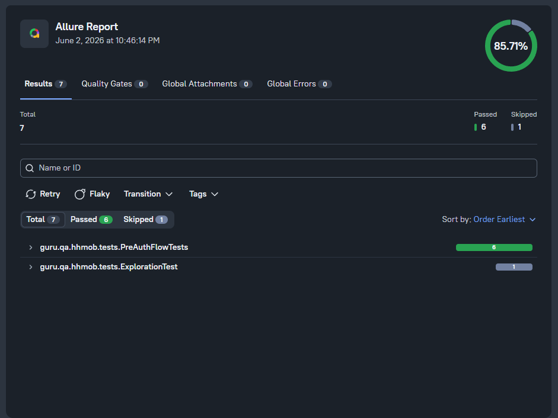

# 📱 hh.ru — Mobile Automated Tests


Автоматизированные тесты для нативного Android-приложения hh.ru на **Appium**, **JUnit 5**, **Gradle** и **Allure**. Screen Object pattern, профильный переключатель локальный/BrowserStack.

Часть дипломного проекта **QA.Guru** (Java Base): [UI](https://github.com/sadchill82/hh-ui-tests) / [API](https://github.com/sadchill82/hh-api-tests) / Mobile / [Manual](https://github.com/sadchill82/hh-manual-tests).

---

## 🔧 Стек технологий

| Инструмент | Назначение |
|---|---|
| [](https://openjdk.org/projects/jdk/21/) | Язык программирования |
| [](https://gradle.org/) | Система сборки |
| [](https://appium.io/) | Mobile automation |
| [](https://github.com/appium/appium-uiautomator2-driver) | Android-драйвер |
| [](https://junit.org/junit5/) | Тестовый фреймворк |
| [](https://docs.qameta.io/allure/) | Отчёты о тестах |
| [](https://www.browserstack.com/) | Облачные девайсы |
| [](https://jenkins.autotests.cloud/) | Continuous Integration |

---

## 📁 Структура проекта

```
hh-mobile-tests/
├─ build.gradle.kts
├─ gradlew, gradlew.bat
├─ images/                   — скриншоты Jenkins/Allure/Telegram для README
└─ src/test/
   ├─ java/guru/qa/hhmob/
   │  ├─ config/             — MobileConfig + Project (профильный переключатель)
   │  ├─ drivers/            — DriverFactory: local / browserstack
   │  ├─ helpers/            — Attach (screenshot, page source, BS-сессия)
   │  ├─ screens/            — LanguageDialog, EntrySplashScreen, LoginMethodsScreen
   │  └─ tests/              — BaseTest + PreAuthFlowTests
   └─ resources/
      ├─ apps/               — hh.apk (arm64-v8a, не в git)
      └─ config/             — local.properties, browserstack.properties
```

В мобильной автоматизации Page Object исторически называют **Screen Object** — отсюда пакет `screens/`.

---

## 🎯 Что покрываем

С ~2023 приложение hh.ru полностью за auth-стеной — нельзя посмотреть даже список вакансий без логина, а логин требует SMS-кода + капчу. Гостевого режима нет.

Поэтому тесты — на pre-auth onboarding флоу:

- Диалог выбора языка («Переключить на английский? / Оставить русский»)
- Splash «Работа у вас в кармане» с кнопками входа
- Экран «Вход и регистрация» (телефон / e-mail / другие способы / для работодателя)
- Кнопка «Назад» возвращает на splash

Каждый тест запускается с `fullReset=true` — APK переустанавливается, диалог первого запуска повторяется.

Screen Objects ищут элементы по `UiSelector().textContains(...)`. У hh.ru Compose-UI, поэтому `resource-id` обфусцированы (`ru.hh.android:id/Kifork`) и бесполезны.

---

## 🚀 Запуск локально

### 📌 Предусловия

1. **JDK 21**
2. **Node.js 20+** + Appium 2.x:
   ```bash
   npm install -g appium
   appium driver install uiautomator2
   ```
3. **Android SDK** через Android Studio. Переменные:
   ```bash
   setx ANDROID_HOME "%LOCALAPPDATA%\Android\Sdk"
   setx ANDROID_SDK_ROOT "%LOCALAPPDATA%\Android\Sdk"
   ```
4. **AVD** через Device Manager (Pixel 10 Pro Fold, API 36)
5. **hh.apk** с **arm64-v8a** ABI положить в `src/test/resources/apps/hh.apk`. Найти можно поиском «hh» или «headhunter» на [apkmirror.com](https://www.apkmirror.com/?post_type=app_release&searchtype=apk&s=headhunter) или [apkpure.com](https://apkpure.com/search?q=hh.ru).

### ▶️ Запуск

```bash
# терминал 1
emulator -avd Pixel_10_Pro_Fold

# терминал 2
appium

# терминал 3
./gradlew test -Denv=local
```

---

## ☁️ Запуск на BrowserStack

1. Регистрация на [browserstack.com](https://www.browserstack.com/) (free tier 100 минут)
2. Загрузить APK:
   ```bash
   curl -u USER:KEY -X POST https://api-cloud.browserstack.com/app-automate/upload \
        -F "file=@src/test/resources/apps/hh.apk"
   ```
3. Переменные:
   ```bash
   setx BROWSERSTACK_USERNAME "your-user"
   setx BROWSERSTACK_ACCESS_KEY "your-key"
   setx BROWSERSTACK_APP_URL "bs://<hash>"
   ```
4. Запуск:
   ```bash
   ./gradlew test -Denv=browserstack
   ```

---

## 📊 Jenkins и Allure

**Jenkins Job:**
[Перейти к Jenkins](https://jenkins.autotests.cloud/job/C39-sadchill82-hh-mobile-tests/)

**Allure Report:**
[Перейти к Allure](https://jenkins.autotests.cloud/job/C39-sadchill82-hh-mobile-tests/allure)

### Скриншот Allure-отчёта



### Генерация отчёта локально

```bash
./gradlew allureServe
```

В отчёт цепляются:

- Скриншот на момент конца теста
- Page source XML (полное дерево UI)
- Ссылка на сессию BrowserStack (для облачных запусков)
- Шаги через `@Step`

---

## ✅ Покрытие тестами

**6 тестов** в `PreAuthFlowTests`:

1. На первом запуске показывается диалог выбора языка
2. Тап «Оставить русский язык» закрывает диалог и открывает splash
3. На splash есть упоминание политики конфиденциальности
4. Тап «Я новый пользователь» открывает экран способов входа (телефон/e-mail/другие)
5. На экране входа есть путь «Найти сотрудников» (для работодателей)
6. Кнопка «Назад» возвращает на splash

Полный прогон — ~1 мин 20 сек (большую часть времени съедает переустановка APK по `fullReset=true`).

---

## 🔍 Если селекторы плывут

UI обновился → снять `@Disabled` с `ExplorationTest`, прибить приложение, прогнать:

```bash
adb uninstall ru.hh.android
./gradlew test --tests "guru.qa.hhmob.tests.ExplorationTest"
```

В `build/exploration-*.xml` будут полные дампы page source. Обновить тексты в `screens/*.java`.

---

## ⚠️ Ограничения

- **Только pre-auth флоу.** Поиск, отклик, фильтры — за логин-стеной (SMS + капча).
- **`fullReset=true`** — каждый тест ~12-15 секунд только на reinstall APK.
- **APK должен быть `arm64-v8a`** (или universal). `armeabi-v7a` падает с `INSTALL_FAILED_NO_MATCHING_ABIS` на x86_64-эмуляторе.
